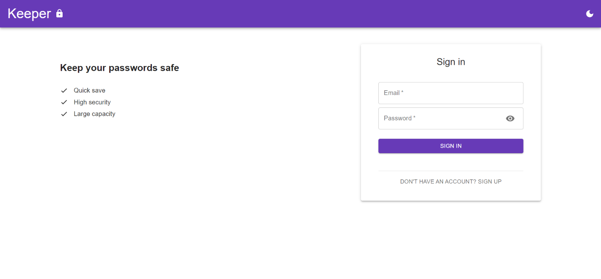
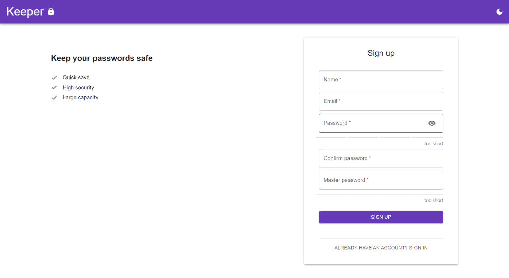
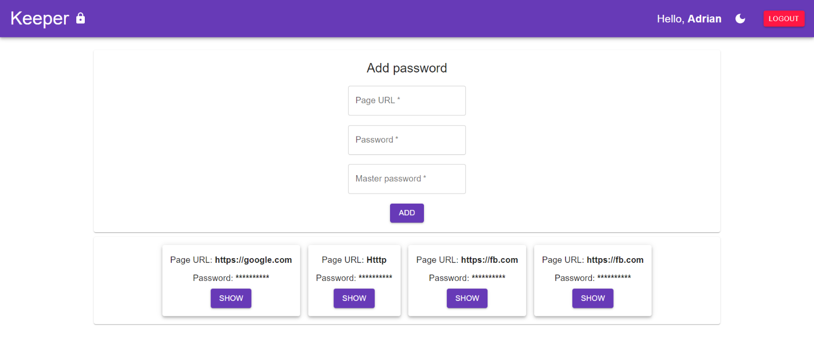
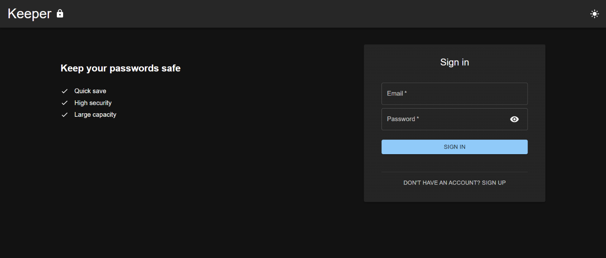
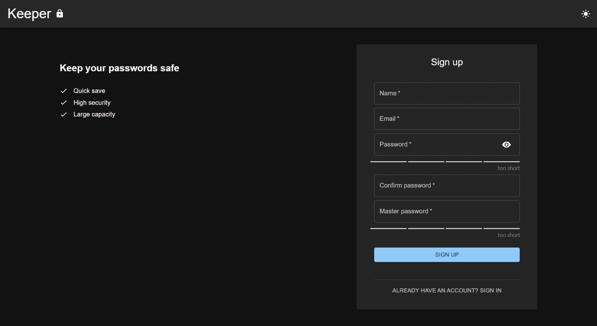
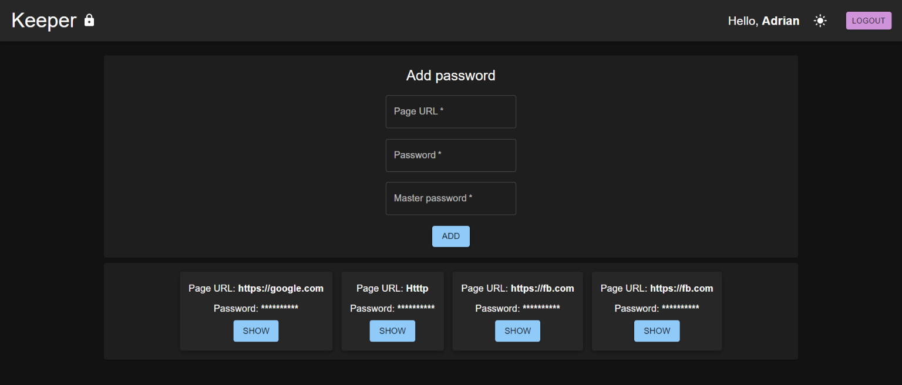

<h1 align="center">
  Keeper 
   
  
   
</h1>

<b>Make your passwords safe again.</b>
 
Store your sensitive data for certain websites with high security provided.

## The problem

An ordinary user have multiple accounts on a various websites. 
That generates so many passwords to remember. Isn't it annoying? Yes, we know that it is.
That's why I build this app called <b>Keeper</b>. 

## This solution

<b>Keeper</b> provides a user-friendly UI for storing passwords for your accounts. 
Website can be proud of it's <b>high security</b> and <b>robustness</b>. 
At first, user have to create a new account. 
Name, email, ordinary password and master password must be provided there.
After that, you can store any passwords you want using master password. Added passwords are encrypted,
so you have to enter master password again to decrypt them. 

## Table of Contents

- [Requirements](#requirements)
- [Installation](#installation)
- [Configuration](#configuration)
- [Usage](#usage)
- [Technologies](#technologies)
- [Screenshots](#screenshots)

## Requirements

[Node](http://nodejs.org/) is really easy to install & now include [NPM](https://npmjs.org/). You should be able to run the following command after the installation procedure below.

    $ node --version
    v16.13.0

    $ npm --version
    8.1.0

Except node, you have to install [yarn](https://yarnpkg.com/)

    $ npm install --global yarn

## Installation

    $ git clone https://github.com/milewsa3/keeper-frontend.git
    $ cd keeper-frontent
    $ yarn install

## Configuration

Create new file `.env` in main folder. Adjust configuration for the app.
You can see example config in `.env.example`.

## Usage

    $ yarn start

## Technologies

* [React 17.0.2](https://pl.reactjs.org/)
* [Material-UI 5.2.3](https://mui.com/)
* [Redux Toolkit 1.7.1](https://redux-toolkit.js.org/)
* [Axios 0.24.0](https://github.com/axios/axios)

## Screenshots

### Light theme

### Dark theme

